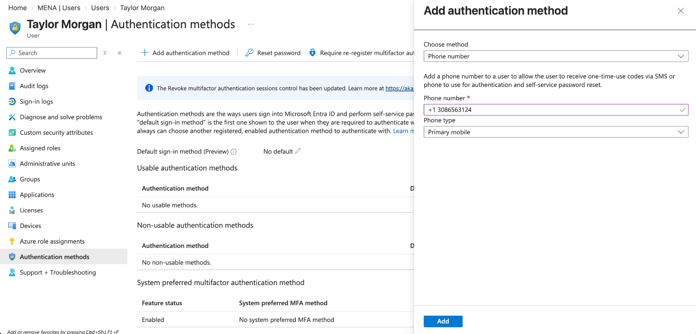
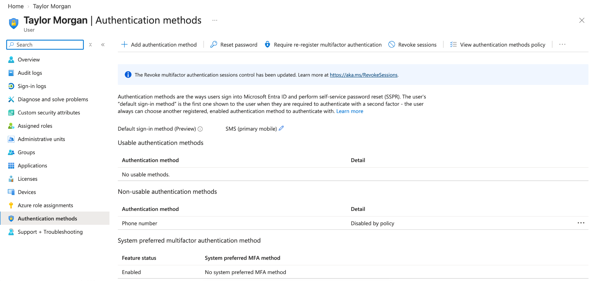
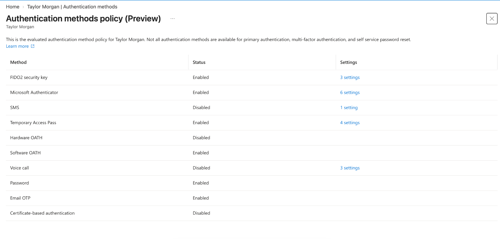
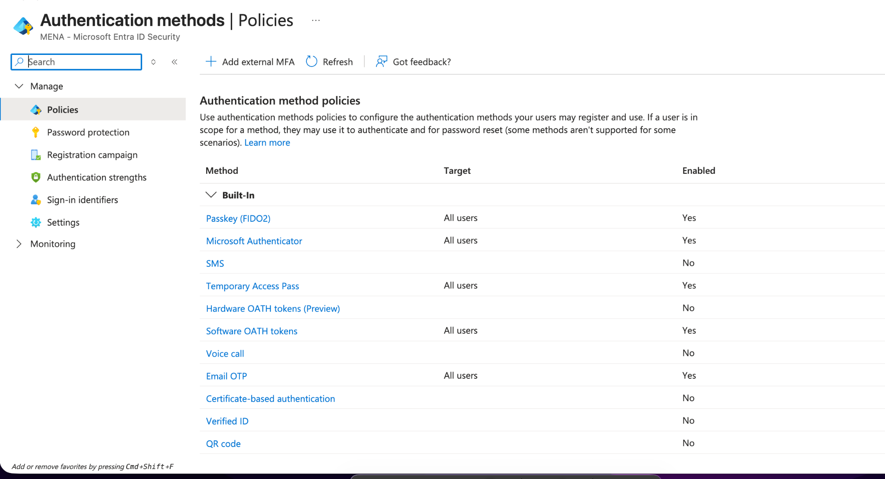
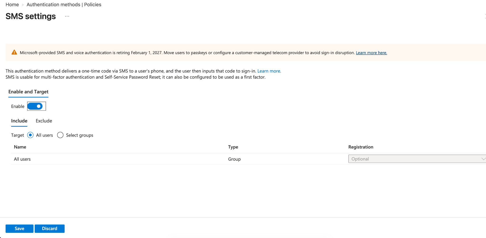
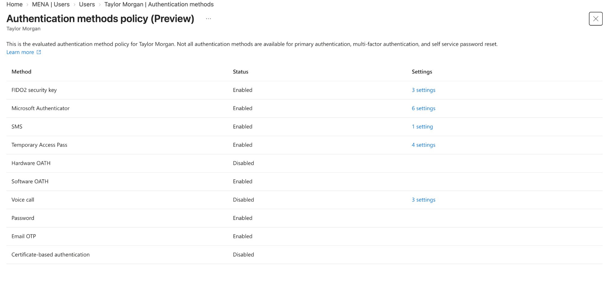
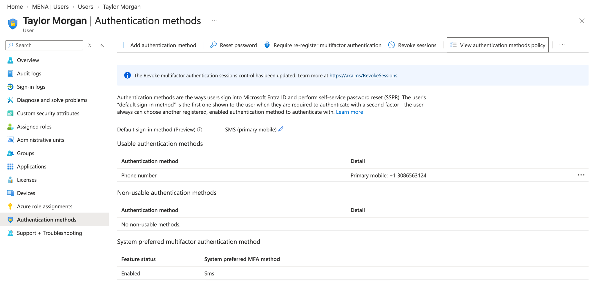

# Microsoft Entra ID Authentication & MFA

## Project Overview

In this lab, I practiced configuring and troubleshooting an authentication method in Microsoft Entra ID.

I added a phone-based authentication method to a test user and discovered that the method was not usable because SMS authentication was disabled by policy.

I then reviewed the user's evaluated authentication methods policy, located the tenant-level SMS authentication policy, enabled SMS for the lab environment, and verified that the phone method became usable.

The goal was to gain hands-on experience with authentication method configuration, MFA-related policies, and troubleshooting authentication issues in Microsoft Entra ID.

## Technologies Used

- Microsoft Entra ID
- Microsoft Azure
- Identity and Access Management (IAM)
- Multi-Factor Authentication (MFA)
- Authentication Methods Policy
- SMS Authentication

## What I Practiced

- Reviewing user authentication methods
- Adding a phone authentication method
- Identifying an authentication method blocked by policy
- Reviewing a user's evaluated authentication policy
- Reviewing tenant-wide authentication method policies
- Enabling SMS authentication in a lab environment
- Verifying policy changes
- Confirming that an authentication method became usable
- Troubleshooting authentication configuration issues

## Step 1: Add a Phone Authentication Method

I opened **Taylor Morgan's** account in Microsoft Entra ID and navigated to the **Authentication methods** section.

I selected **Phone number** as the authentication method and configured it as a primary mobile method.

A lab phone number was used for this exercise.

## Step 2: Identify a Policy Issue

After adding the phone authentication method, I reviewed the user's available authentication methods.

The phone number appeared under **Non-usable authentication methods** with the message:

**Disabled by policy**

This showed that adding an authentication method to a user does not automatically mean the method is permitted for authentication.

## Step 3: Review the User's Authentication Methods Policy

I opened **View authentication methods policy** to review which authentication methods were currently available to Taylor Morgan.

The evaluated policy showed that several methods were enabled, including:

- Microsoft Authenticator
- FIDO2 security keys
- Temporary Access Pass
- Software OATH

However, **SMS was disabled**.

## Step 4: Review the Tenant Authentication Policy

I navigated to:

**Microsoft Entra ID > Authentication methods > Policies**

From the authentication method policies page, I confirmed that SMS authentication was disabled at the tenant policy level.

## Step 5: Review SMS Authentication Settings

I opened the **SMS settings** page to review the current configuration before making any changes.

The SMS authentication method was disabled, and the policy was configured with **All users** as the target.

## Step 6: Enable SMS Authentication

Because this environment was being used specifically for hands-on lab practice, I enabled SMS authentication and kept the policy targeted to **All users**.

Registration remained optional.

> **Lab Note:** Microsoft Entra displayed a notice stating that Microsoft-provided SMS and voice authentication is retiring on February 1, 2027. I used SMS in this project to practice authentication policy configuration and troubleshooting within the lab environment.

## Step 7: Verify the Authentication Policy

After saving the policy change, I returned to Taylor Morgan's evaluated authentication methods policy.

SMS now showed:

**Enabled**

This confirmed that the tenant policy change was being applied to the user.

## Step 8: Verify the Authentication Method Became Usable

Finally, I returned to Taylor Morgan's **Authentication methods** page.

The phone number had moved from **Non-usable authentication methods** to **Usable authentication methods**.

The page also showed:

- **Default sign-in method:** SMS (primary mobile)
- **System preferred MFA method:** SMS
- **Non-usable authentication methods:** None

This confirmed that the authentication policy change successfully allowed the registered phone method to become usable.

## Troubleshooting Summary

During this lab, the phone authentication method was successfully added to the user but initially could not be used because SMS authentication was disabled by policy.

I worked through the issue by:

1. Identifying the **Disabled by policy** message
2. Reviewing the user's evaluated authentication methods policy
3. Confirming that SMS was disabled at the tenant level
4. Opening the SMS authentication policy
5. Enabling SMS for the lab environment
6. Verifying that the updated policy applied to the user
7. Confirming that the phone authentication method became usable

## Skills Practiced

- Microsoft Entra ID
- Identity and Access Management
- Authentication Method Management
- MFA Policy Configuration
- Authentication Policy Review
- SMS Authentication
- User Authentication Administration
- Troubleshooting
- Configuration Verification
- Technical Documentation

## What I Learned

This lab helped me understand that registering an authentication method and allowing that method through policy are separate parts of Microsoft Entra ID authentication management.

I learned how to identify when an authentication method is blocked by policy, review both user-level evaluated settings and tenant-level authentication policies, make a policy change, and verify that the change was successfully applied.

The troubleshooting portion of this lab was especially helpful because it required me to identify why the phone method was not usable instead of assuming that adding the method automatically enabled it.
